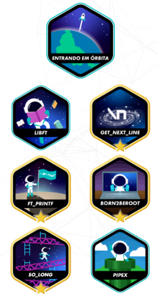

# 42 São Paulo

  
  

> Projetos realizados durante o período que estive na 42 São Paulo. Projetos feitos em C e Shell, com o objetivo de aprender a programar e a utilizar o Git.

## 📝 Licença

Esse projeto está sob licença GNU General Public License v3.0. Veja o arquivo [LICENSE](LICENSE) para mais detalhes.

[⬆ Voltar ao topo](#nome-do-projeto) 
